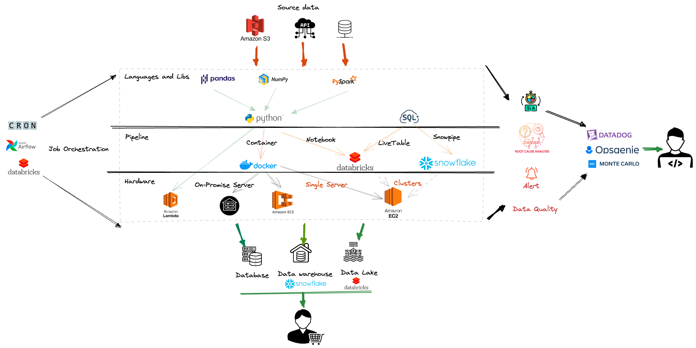

# Stytch Offline Analytics & Online observability System

### Author: Zhongyuan(Thomas) Li
### Date: 2022/08/29
  

## Requirement
1. How do we give our customers insight into data from the last six months?
2. What products and infrastructure should we build? if we're going to have 2-3 engineers focus on building data products for our customers.
3. How do we present data to our clients?
4. How do we manage that system?
5. Understand the trade-offs and make specific recommendations on what to build.

## Offline Analytics
1. BI dashboards or reports can be created by using data (including historical) stored in data warehouse or data lake.
2. The below productions should be built:
   - Data ingestion pipeline(s)
   - Data storage system (database, data warehouse or data lake)
   - Data visualization tools or reports
   - To support the above products, the following products are also needed:
     - Job orchestration to schedule pipelines
     - SLA and Data quality system to check the status of data pipeline
     - Alerting and incident response tool to notify any failures and for root cause analytics
3. Proactive and reactive data presentation
   - Client can query data via a SQL endpoint
   - Client and subscribe dashboard from a BI system
   - Files can be delivered to client via email, ftp, etc..

## Online Observability and Data Quality Monitoring
Apart from the SLA, Data quality, Alerting&Incident Response tool, we can use predefined logs to develop our own data management system. For example:
   - Save **all pipeline logs** to a predefined table, which can be used for monitoring, lineage and data quality reporting.
   - Below information can be stored into the table:
     - Pipeline execution and completion time
     - Row count for each run
     - How many records got updated, inserted, deleted, etc..
     - Any failures happened in the middle
     - etc..
   - Create a **DQ dashboard** to show:
     - Status of each pipeline
     - The percentage of job failure/success
     - Row count trend
     - Root cause analytics
     - etc..
   - Any other data observability systems (like DataDog, Monte Carlo) can also be used for this purpose.

## Trade-offs & Recommendations 
1. Data volume
    - Multiple data sources + large data volume: big data computation on cloud
    - Single data source + small data volume: local, on-premise or single server
2. Data source
   - Structured data: database / data warehouse
   - Structured + unstructured + semi-structured data: data lake
3. Data cleaning / transformation
   - Data preprocessing + Joining + aggregation: multiple layers (raw, cleaned, consumer) of data transformation
4. Historical data and archive
   - Only keep data generated recently
   - Archive historical data and save cost of storage
5. Pipeline scalability
   - Develop a generic platform to handle different data ingestion requirements
6. Data analytics 
    - AI + Machine learning support
    - BI dashboard and reporting support
7. Data observability
   - Use product like data dog, Monte Carlo, etc.
   - Develop own data management/monitoring system using any predefined pipeline logs
8. Tools for both Offline Analytics and Online data observability
   - **A tool can support both functionality (Data Ingestion + Query Endpoint + Dashboard)**